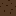
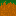
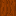
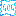
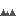
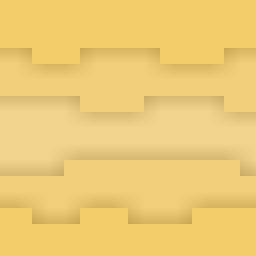
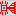
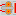
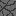

# TILES

### Current Tiles
 *  **Dirt**
 *  **Stone**
 *  **Grass**
 *  **Log**
 *  **Leaves**
 *  **Fader**: fades after 5 seconds
 *  **Spikes**: not solid, needs support
 *  **Sand**: falls after 0.1 seconds
 *  **Creator**: pushes a new tile of the selected type in front of it (currently using an interval for tests)
 *  **Piston**: pushes tiles in front of it when activated (currently using an interval for tests)

### Tile Ideas
 *  **Trigger**: not solid, activated when entity inside (or other condition)
 *  **ArrowTrap**: shoots an arrow when the linked trigger is activated
 *  **Water**: falls but also spreads
 *  **Spawner**: spawn an entity when triggered
 *  **Checkpoint**: allows the player to respawn at it when triggered
 *  **Unstable**: destroys itself soon after being walked on
 *  **Activated**: can disappear/appear on command
 *  **Chest**: can be broken to loot it's contents
 *  **Bouncing**: entities can bounce on it
 *  **Repulsor**: repels entities that are close to it